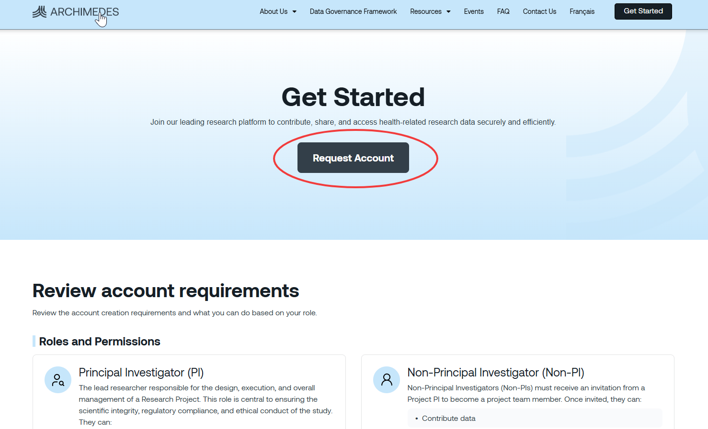

Creating an [ARCHIMEDES](https://www.archimedesdata.ca/) account will allow you to manage your profile, contribute data, access to controlled data and initiate data release. The process for requesting an account on ARCHIMEDES varies depending on whether you are a Principal Investigator (PI) or a research project team member. 

In this section, we will guide you step by step on how to set-up an ARCHIMEDES account to access the platform.

##  **Create an account as a Principal Investigator**

➡️ Step 1: Go to the  [Get Started ](https://www.archimedesdata.ca/get-started/) page and Click on [Request Account](https://archimedes.loris.ca/?page=request)

➡️ A new window will open with the Request Account form. 

➡️ Step 2: Fill the form and agree to the Terms of Use (Details available by clicking on the link)

➡️ Step 3: You will receive an email confirmation of your account request. 

➡️ Step 4: Check your institutional inbox.  
 
* If your institution already has a DCA, the ARCHIMEDES team will provide instructions on activating your account.    
* If your institution does not yet have a DCA, the ARCHIMEDES team will work with your institution's legal signing authority to establish one before your account can be approved. 

##  **Get access as a non‐Principal Investigator**

Users who are not Principal Investigators (PIs) cannot create an [ARCHIMEDES](https://www.archimedesdata.ca/) account independently. To obtain access, they must be invited by a PI and receive an invitation code to join an existing project. After joining the PI’s project, invited users will be able to either contribute data to the project or access controlled data, depending on the permissions assigned to them.

