Once your account creation is approved, you can begin the process of creating a new project.
ARCHIMEDES supports two types of data contributions:

* **Coded data**: Data subject to (i) an ethics approval and informed consent that authorize sharing; (ii) an ethics waiver of informed consent requirement, or (iii) another legal authorization. All direct identifiers (e.g., names, social insurance numbers) must be removed and replaced with a unique code prior to contribution.

* **De-identified data**: Data can be shared if it is de-identified (or local equivalent). This requires that all direct identifiers and most indirect identifiers must be removed or transformed to reduce the risk of re-identification to a very low level, in accordance with recognized standards and applicable legal and ethical requirements.

There are two main steps to create a new project, submit a **Data Contribution Form** (DCF) and _Create a New Project_ in ARCHIMEDES.

## **Submit a Data Contribution Form (DCF)**

➡️  From the dashboard, go to _Project Requests_  and click on _Create New Project_.

➡️  A _Create New Project_ window will open, asking you to enter the study name and the Principal Investigator’s (PI’s) information.

**ℹ️Note**: PI's information is autopopulated based on the account information. If the information you see is incorrect, you can modify it in the "my preferences", section available under your name.

➡️  Click _Next_.

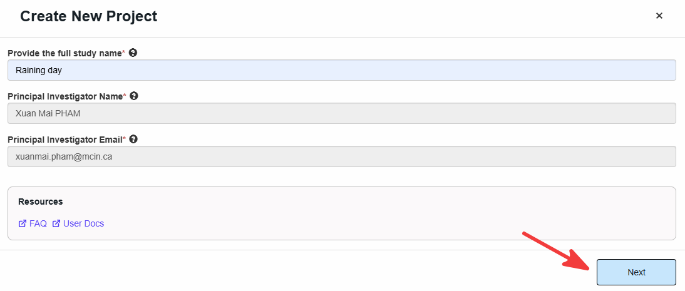

➡️ Agree to the Data Contributor Terms of Use and click on _Agree & Create New Project_.

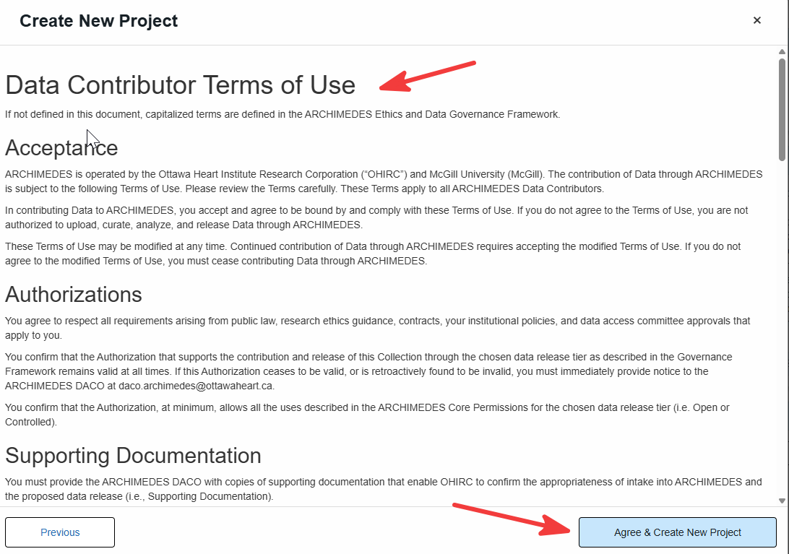

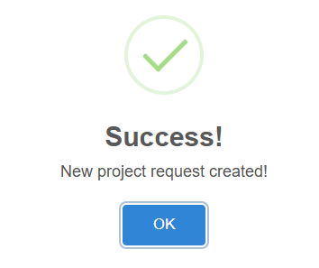{ width=300 .center }

➡️ The project will be registered and a confirmation window will open displaying a unique **Request ID** and a link to complete the Data Contribution Form (DCF). A confirmation email will also be sent containing this information.

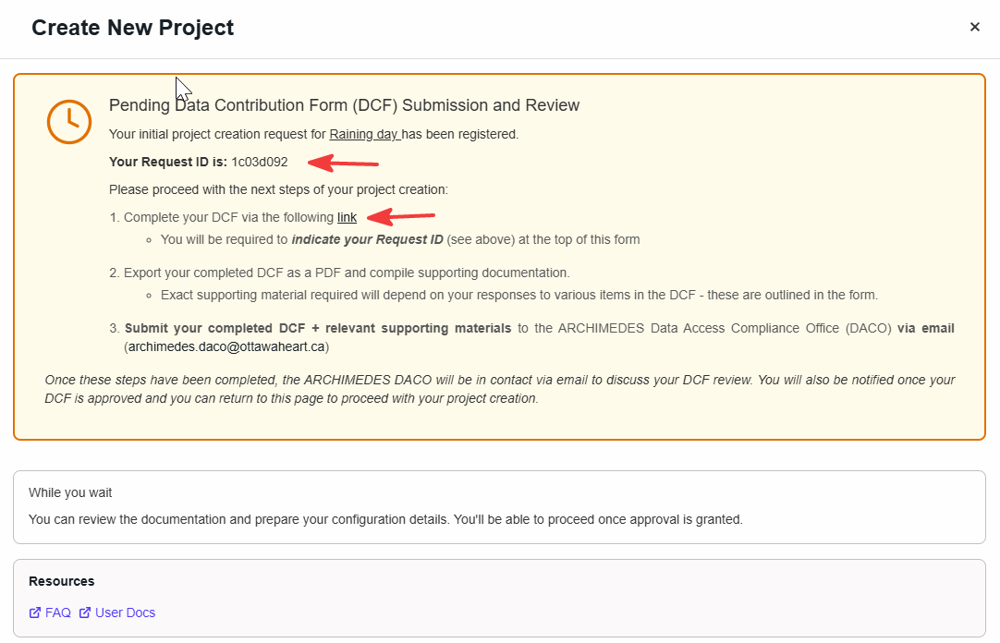

➡️  Complete the DCF [MS form link](https://forms.office.com/Pages/ResponsePage.aspx?id=tkGbhQ8TE02mkx_-xOfLWqZhQKT6f7FMsuYEY64tJaNUNUlDMkk5OFI5RFZPU1JEWDJVN1VSNldMNS4u).

➡️  **Send The DCF (pdf format) with the requested supporting material to the Data Access Committee Office (DACO) at [archimedes.daco@ottawaheart.ca](mailto:archimedes.daco@ottawaheart.ca)**.

➡️  This _New Project_ will be pending until the DACO uploads the approved DCF.

➡️ From the dashboard, you can track the status of your project request under _Project Requests_. Click on the status to view additional details.

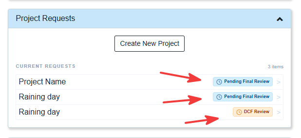{ .center }

➡️ Approval status will be updated in a timely matter. 

➡️  Once the DCF is approved by the DACO, click on the status (_DCF Approved_) and proceed to the next step.  

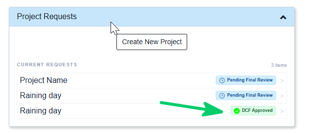{ .center }  

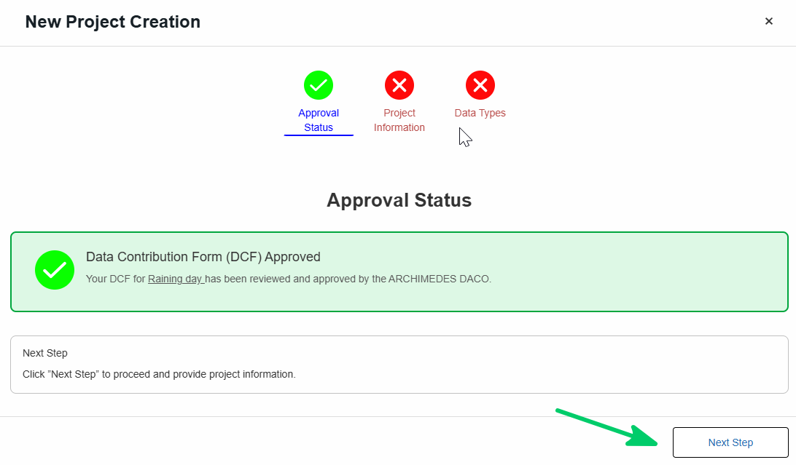{ width=700 .center }

## **Create a New Project**

Complete the following steps to provide the required project information:

### 🗂️ Project information

In this section, you will be asked to provide general information about your project, including the study design, study population, expected number of participants, participant groups, contact information, institutional information, session information, and supporting documentation such as the study protocol.

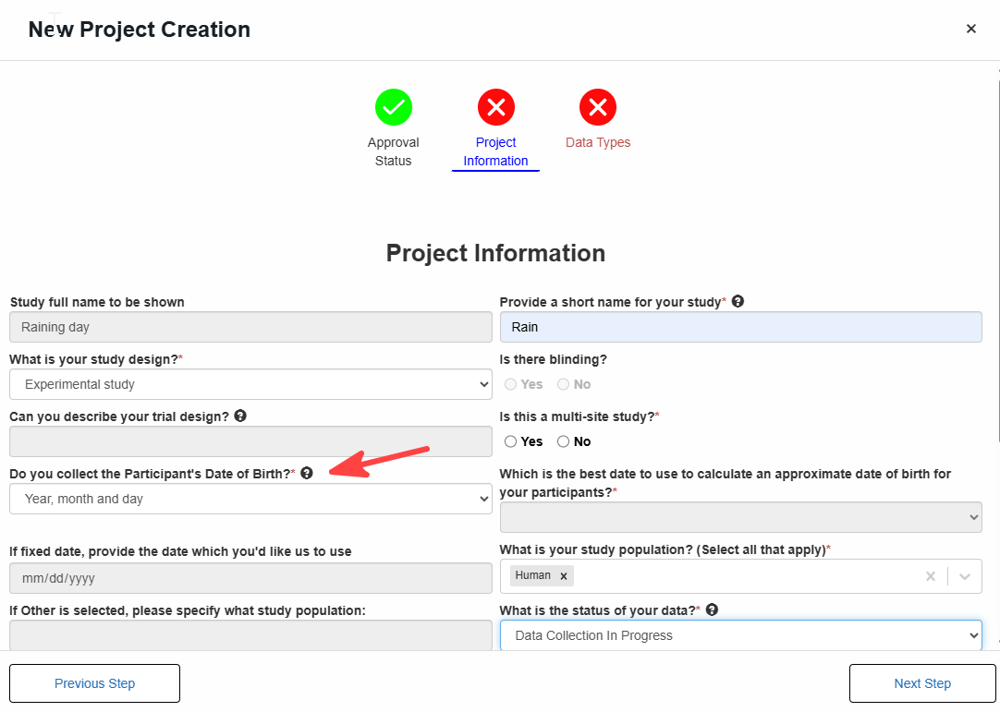

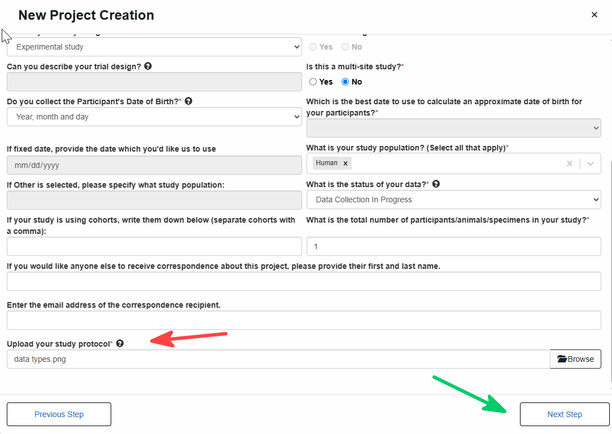

💡**Tip**: a tooltip will appear when you hover over the icon 

💡**Tip**: Health data may contain direct identifiers (e.g., names, health card numbers, exact addresses), indirect identifiers (e.g., **date of birth**, postal code, rare diagnoses), or embedded identifiers (e.g., metadata in imaging files or text within images). These elements must be carefully reviewed and either removed or modified to protect privacy.  
  
➡️ According to [ARCHIMEDES Data Submission](https://docs.google.com/document/d/1gpxSvGPcu3ioSSPNFqOJJtC5vvxRFu2t/edit), **Date of Birth** (DOB) is required as it supports data validation, structuring, and analysis (e.g., age consistency and longitudinal tracking). While the full format **MM-DD-YYYY** is preferred, users may alternatively provide **MM-YYYY** or **YYYY** when full DOB is not available or cannot be shared. If the year is not available, users may provide **age** only. In these cases, the system applies a default setting that calculates a standardized DOB based on the available information (month/year or age) to ensure consistency within the database structure, while still treating DOB as an indirect identifier and maintaining privacy protections.

💡**Note**: A ❌ indicates missing required information

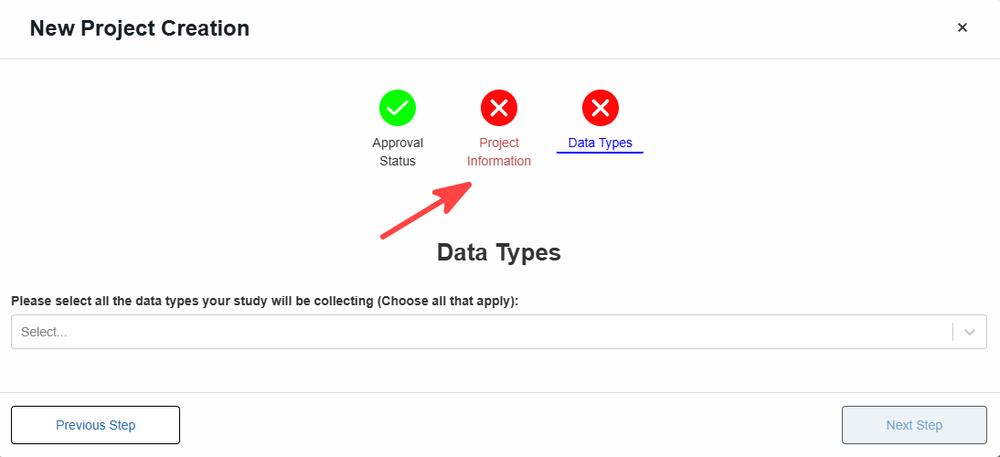

Once all required information has been provided, a ✅ will appear.

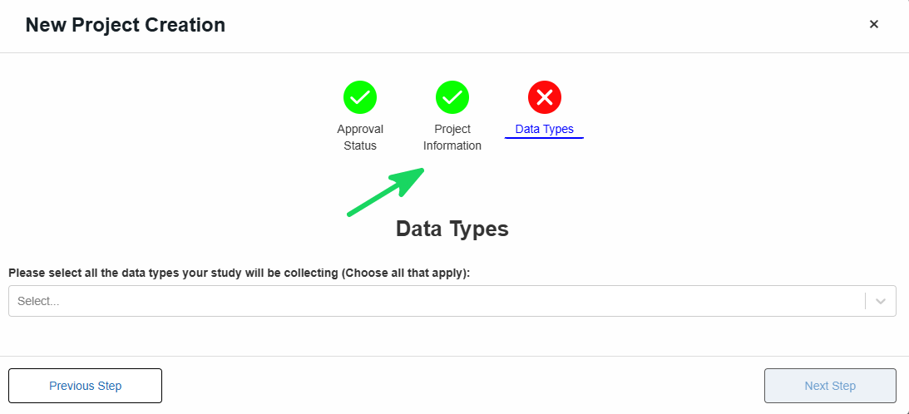

### 🔬 Data Types

Most studies include multiple data type. Select all that apply from the drop down menu. 

Once you have selected all data types included in your project, you will have to complete a separate form for each one.
The example below shows the Imaging form, which is required when Imaging is selected as a data type.

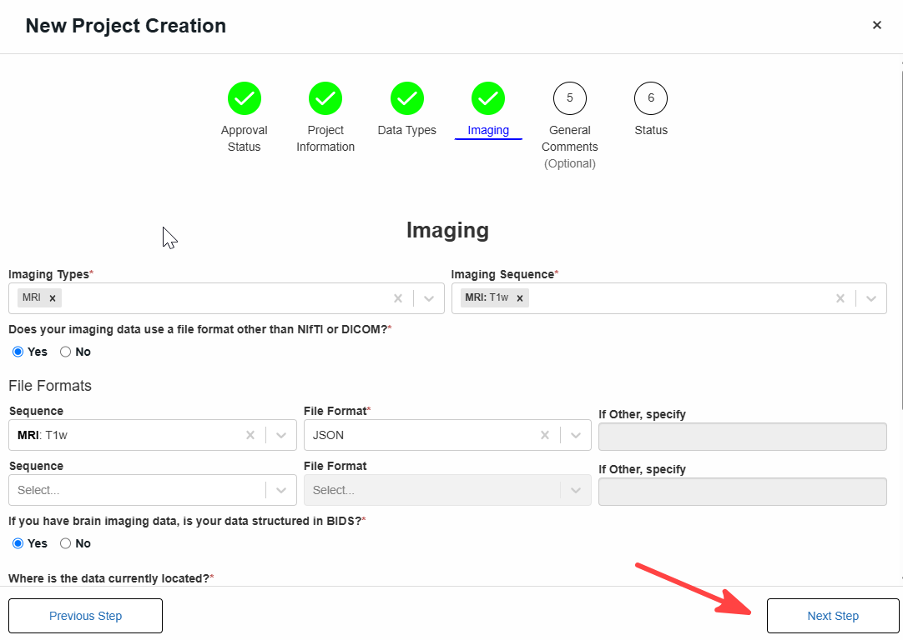

💡 The descriptions below provide examples of the types of data that may be collected, generated, or analyzed as part of your research.

#### 🧠 Behavioural

  - Participant actions, habits, or self-reported experiences  
  - Examples: surveys, questionnaires, cognitive tests, activity logs

#### 🖼️ Imaging

  - Visual or radiological data capturing anatomy or function  
  - Examples: MRI, CT scans, X-rays, ultrasound, PET scans  

#### 🧪 Biospecimen

  - Biological samples collected for analysis  
  - Examples: blood, tissue, saliva, urine  

#### 🧬 -Omics

  - Molecular or genomic data derived from DNA or RNA  
  - Examples: whole genome sequencing, genotyping, gene expression data  

#### ⌚🔄 Wearables and continuous monitoring

  - Data collected over time via devices or sensors  
  - Examples: heart rate, sleep patterns, activity tracking from smartwatches or wearable sensors  

#### 📏 Other Measurements

  - Additional clinical or physiological data not included above  
  - Examples: vital signs (blood pressure, temperature), lab results, height, weight    

### ✅ Proceed to the next steps until Status is completed

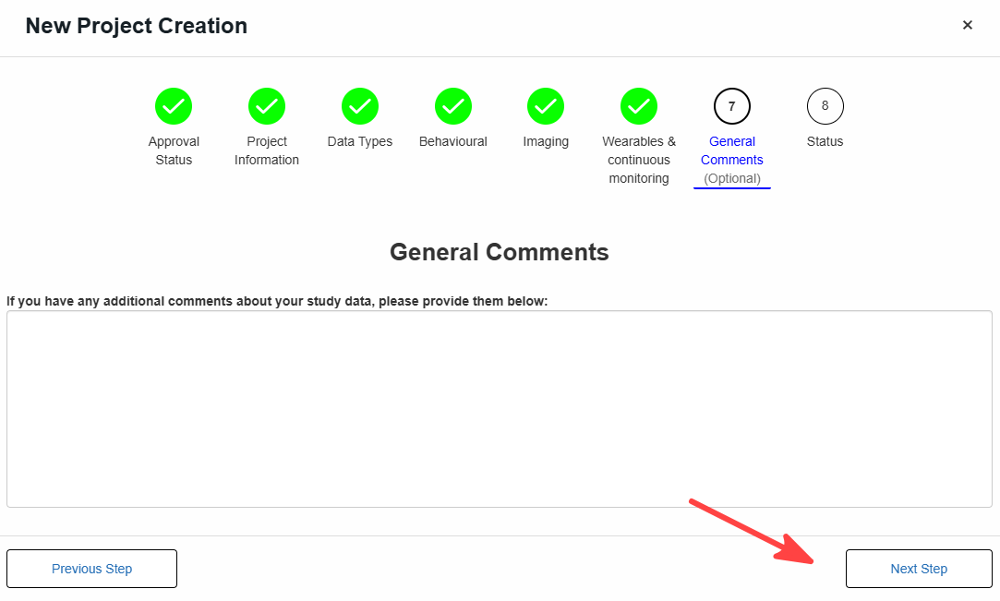

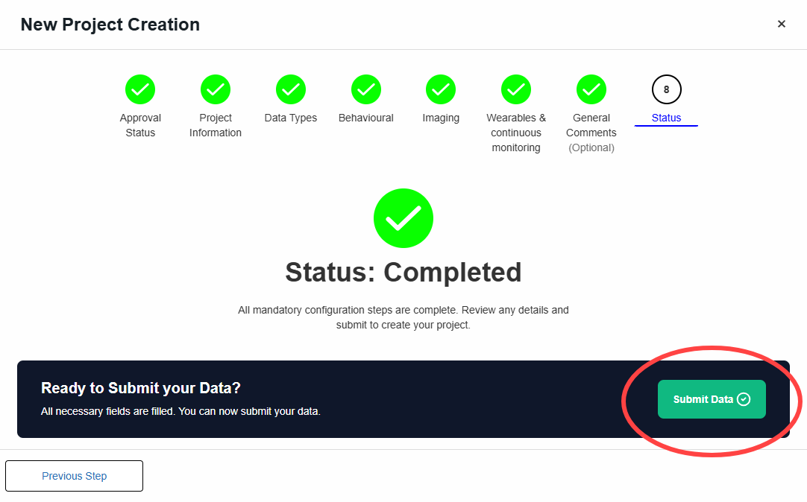

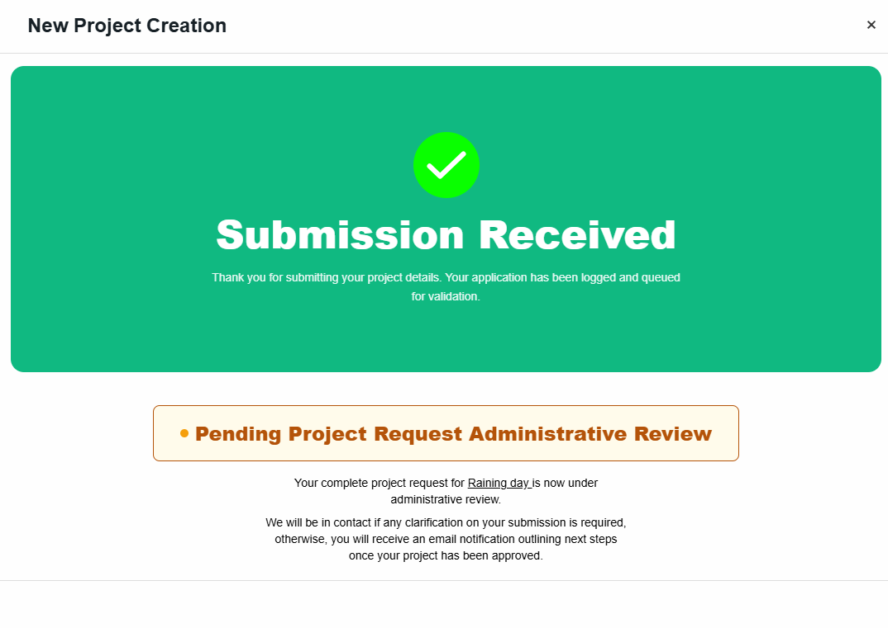

⏳ Your project request is now under administrative review.

If additional information is required, the ARCHIMEDES team will contact you. Once approved, you will receive an email outlining the next steps.
