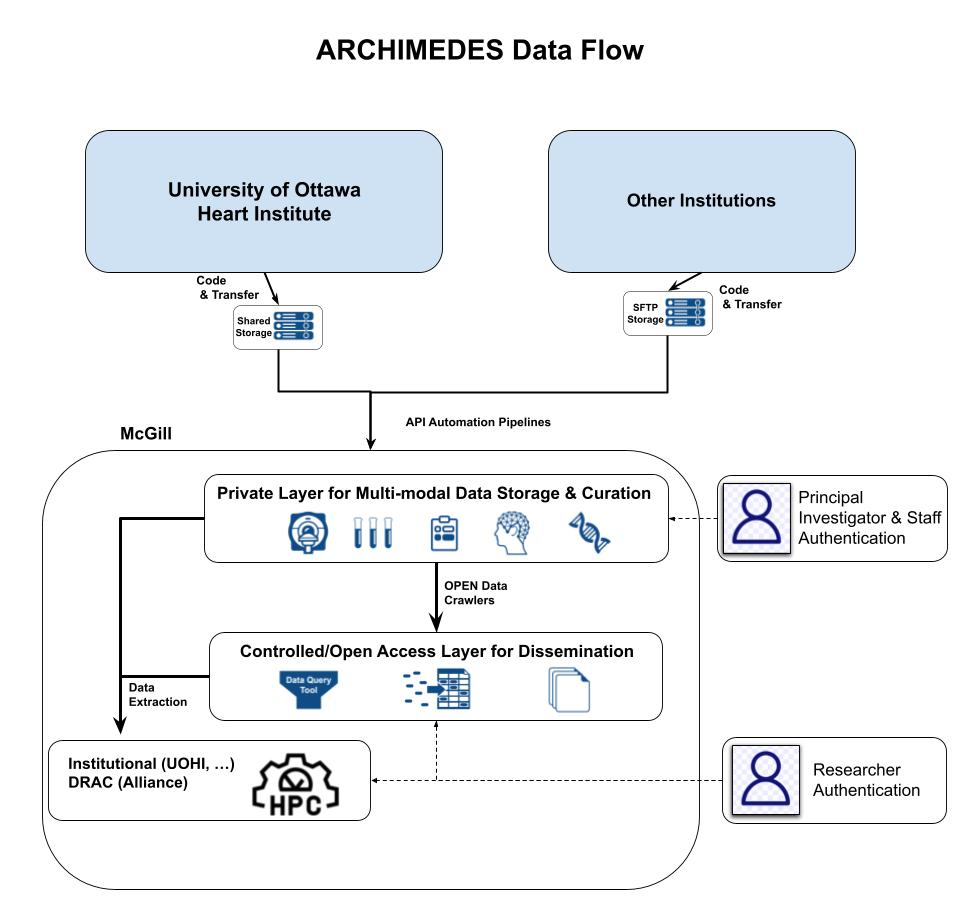

# Welcome to

## Who is this guide for?📘

This guide is intended for users getting started with [ARCHIMEDES](https://www.archimedesdata.ca/). It provides step-by-step instructions on account creation, data access, data transfer, data release, and how to search and analyze data within the platform.

For more information, refer to the [FAQ](https://www.archimedesdata.ca/frequently-asked-questions/) or [Data Governance Framework](https://www.archimedesdata.ca/wp-content/uploads/2026/09/ARCHIMEDES-Data-Governance-Framework-V2-August-2026.pdf)

## What is ARCHIMEDES? 
  
[ARCHIMEDES](https://www.archimedesdata.ca/) (**A**dvanced **R**esearch **C**ollaboration for **H**ealth **I**ntegration, **MED**ical **E**xploration, and data **S**ynthesis) is a digital health platform that ingests, manages, and/or releases Data Sets for research purposes including: biostatistical analyses, predictive modelling, data visualization and artificial intelligence. It also provides a High-Performance Computing (HPC) environment, through which users can analyze ARCHIMEDES data, without requiring external infrastructure.  

All data available on ARCHIMEDES are [coded and/or de-identified](https://archimedesdata.ca/resources/data-de-identification/) prior to upload to ensure privacy and compliance.

## Why use ARCHIMEDES? 🤝

Health research is often slowed down by fragmented data sources, complex infrastructure, and limited access to high-quality datasets.

➡️ [ARCHIMEDES](https://www.archimedesdata.ca/) brings **everything together** in one secure platform—data, governance, and analysis tools—so researchers can work more efficiently and collaboratively.  

➡️ This integrated environment reduces the time and effort spent on data management and technical setup, allowing researchers to focus on analysis and discovery.

Within [ARCHIMEDES](https://www.archimedesdata.ca/), you can:

🧬 Access curated, multi-modal health datasets in one place  
⚙️ Analyze data securely within an integrated HPC environment  
🔐 Reduce technical and administrative barriers to research  
🤝 Improve reproducibility and collaboration across teams  

By simplifying how health data is accessed and used, [ARCHIMEDES](https://www.archimedesdata.ca/) enables you to focus on advancing research and generating meaningful impact on health.
  
🧭 Our vision is to provide a bilingual national health data platform that provides centralized and flexible access to curated health research data, which can be analyzed using state-of-the-art distributed computing tools.  [ARCHIMEDES](https://www.archimedesdata.ca/)   is equipped to ingest all health data including multimodal health data (e.g., behavioural data, imaging data, wearables data). 
  
## What types of data are hosted? 🧬

[ARCHIMEDES](https://www.archimedesdata.ca/) hosts curated, multi-modal health research,  wearable, omics data (genomics, proteomics, transcriptomics, metabolomics, etc.) and summary biospecimen data. This includes both data from human research participants and non-human research data (i.e., pre-clinical data). 

## How can you access data? 🔐

[ARCHIMEDES](https://www.archimedesdata.ca/) uses a flexible access system that allows data contributors to decide how their datasets are shared and accessed.
Data on ARCHIMEDES is presently shared through two tiers:  

**1. Controlled Access 🔒**  
➡️ Data are only available to approved researchers for specific research projects. Researchers must apply for access and agree to follow privacy, ethics, and data use requirements before using the data.   
➡️ ARCHIMEDES allows for coded data, de-identified data, and pre-clinical data through Controlled Access. 

ℹ️: **Data Access Request (DAR) can only be submitted by Principal Investigators (PI)**

**2. Open Access 🔓**  
➡️ Data are made openly available to anyone through [ARCHIMEDES](https://www.archimedesdata.ca/), on a public website.   
➡️ ARCHIMEDES allows for de-identified data and pre-clinical data through Open Access.  

A third tier, **Registered Data Access**, will be available for ARCHIMEDES users in the next phase of the platform’s development.

## How does ARCHIMEDES work? ⚙️

➡️ [ARCHIMEDES](https://www.archimedesdata.ca/)  operates as a centralized platform where data are securely stored and accessed in ways that respect to participant consent, privacy laws, and research ethics requirements (e.g. Tri-Council Policy Statement: Ethical Conduct for Research Involving Humans – TCPS 2).  

➡️ [ARCHIMEDES](https://www.archimedesdata.ca/) supports multiple data types that can be ingested and harmonized within the platform. Once available, data can be analyzed using integrated tools for processing, data analysis, and visualization.
    
The schematic below illustrates the platform’s structure and capabilities.

[Get Started](getting-started.md){ .md-button .md-button--primary }